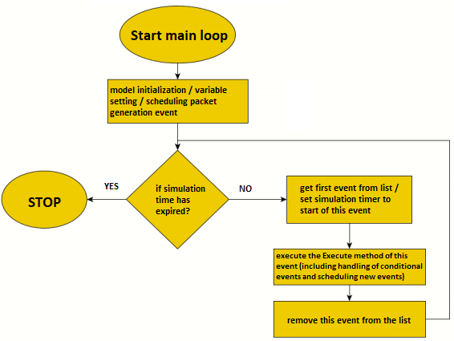

# Wireless Network Simulation

## Table of contents
* [General info](#general-info)
* [Technologies](#technologies)
* [Setup](#setup)

## General info
The application was created to simulate a wireless network based on the CSMA 1-persient protocol. The creation of a properly functioning simulation and the appropriate selection of parameters ensured an average packet error rate of 10%.
The simulation program was created based on the event scheduling method. 
Generators were used to determine pseudo-random values.

**Main loop of simulation:** 

	
## Technologies
Project is created with:
* C++

## Setup
**parameter values entered when running the simulation:**
* Simulation number 1-10 (Parameter for setting different seeds for generators)
* Simulation time in quantum ( 1 quantum = 0.1 ms)
* End of the initial phase (from which package the statistics are to be collected)
* Lambda parameter

**program window after simulation:**  

